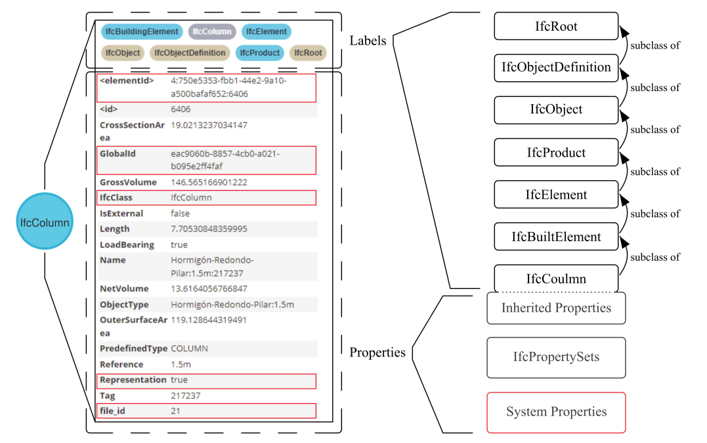
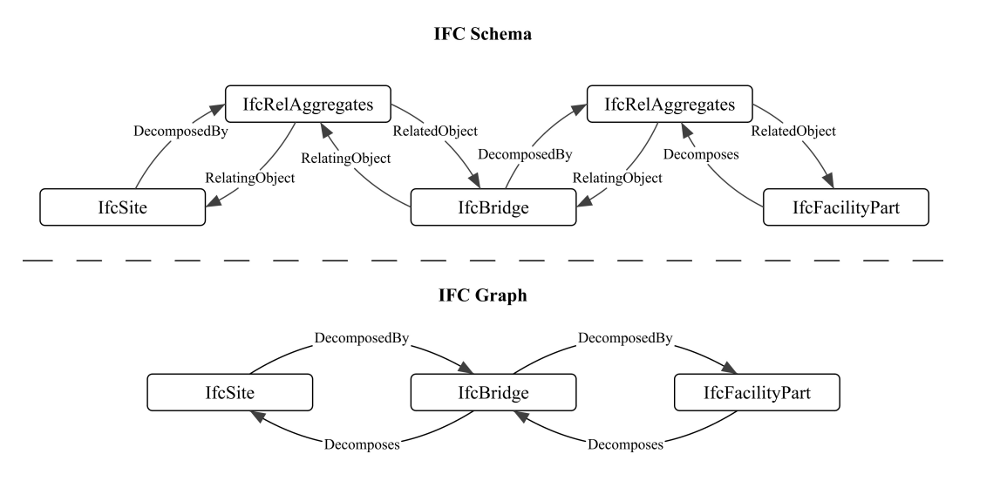

# IFC2Neo4j

**IFC2Neo4j** is a data transformation tool that converts the non-geometrical information of Industry Foundation Classes (IFC) files in STEP format into a Neo4j graph database.

## ⚙️ Conversion Process

The conversion is executed in a decoupled, two-step pipeline. Because the data parsing is separated from the database ingestion, the second step can be easily customized to target other Labeled Property Graph (LPG) databases instead of Neo4j.

1. **Data Modeling and Translation:** The entities and relationships within the IFC file are translated into a generic property-graph data model. This step utilizes **Pydantic** to ensure that the data transformation remains strictly consistent for all nodes and relations in the graph.
2. **Database Import:** The **Neo4j Python driver** is then used to ingest the nodes and relations into the database via Cypher statements.

> **Note on Compatibility:** While the conversion process iterates over all elements to create a graph that closely mirrors the IFC schema, it **does not** maintain backward compatibility with the original IFC format. This is due to intentional modifications made to optimize the data for a graph structure.

---

## 📐 Transformation Rules

The transformation from the IFC schema to the property graph is governed by the following rules:

* **Nodes and Labels:** Nodes in the graph correspond directly to the IFC entities defined in the file. Each node is assigned labels that represent its specific IFC class as well as its parent classes in the IFC hierarchy.
* **Property Inheritance:** All properties inherited from the IFC schema that are associated with an entity are mapped directly to its corresponding graph node.
* **Property Sets:** Any `IfcPropertySetDefinitions` associated with an entity in the file are absorbed and included as properties on the node itself.
* **GUID Formatting:** The standard `IFC-GUID` property is expanded into standard GUIDs.
* **System Properties:** Nodes are enriched with additional "system properties" that are not part of the standard IFC schema. These are injected to improve data filtering and overall usability within the database.
* **Geometry Handling:** All geometry-related classes are excluded from the conversion to keep the graph lightweight. 
    * Instead, a boolean system property called `presentation` is added to the node. 
    * If `presentation` is `true`, the physical geometry can be retrieved from a companion GLB file (generated via the `IfcConvert` process) by referencing the node's GUID.
* **Relationship Bridging:** To optimize the size and query performance of the graph, `IfcRelationships` are *not* imported as standalone nodes. Instead, they are bridged to create direct relationships (edges) between the relevant entity nodes.

